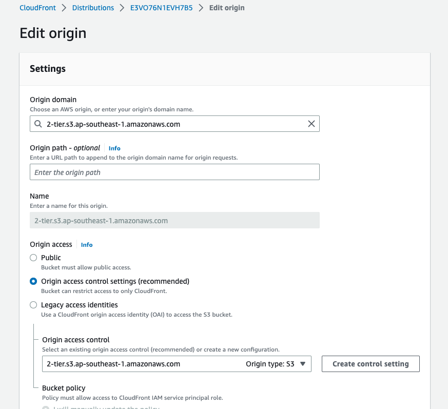

# AWS Techmaster 08 - Lab 2 Tier
## Architecture

## Implement
### EC2 - Auto Scaling Group

### Application Load balcing

### VPC

### S3

### Cloudfront

### WAF
- Update later

### Demo

### Link
[Demo](http://2-tier-1668536003.ap-southeast-1.elb.amazonaws.com/home)